# Learn Rust — Beginner to Advanced

A hands-on Rust learning workspace, structured for someone coming from
**Java, Node.js, TypeScript, React & Angular**. Each concept is a small,
runnable program with comments that map Rust ideas back to languages you
already know.

## How this repo is organized

This is a **Cargo workspace**: one repo, many small packages (crates), one
shared `target/` build directory.

- Folders are named `concept_01_`, `concept_02_`, ... in the intended learning
  order (see [`roadmap.md`](roadmap.md)).
- Each folder is a Cargo package. Concepts live as separate executables under
  `src/bin/`.
- Every binary name is **globally unique** (prefixed with its folder number,
  e.g. `concept_01_01_hello`). This keeps the VS Code shortcut working from
  anywhere in the workspace.

### Running a concept

```bash
# From anywhere in the workspace:
cargo run --bin concept_01_02_variables

# Or classic (cd into the folder first):
cd concept_01_core && cargo run --bin concept_01_02_variables
```

VS Code shortcut (unchanged — works because binary names are unique):

```json
{
  "key": "ctrl+r ctrl+r",
  "command": "workbench.action.terminal.sendSequence",
  "args": { "text": "cargo run --bin ${fileBasenameNoExtension}\u000D" }
}
```

## Roadmap

```mermaid
graph TD
    subgraph Basics
        A[concept_01_core<br/>vars, types, functions, control flow] --> B[concept_02_ownership<br/>ownership, borrow, slices]
        B --> C[concept_03_modules_crates<br/>modules, file modules]
        C --> D[concept_04_structs_enums<br/>structs, enums, Option, match]
        D --> E[concept_05_error_handling<br/>Result, ?, thiserror, anyhow]
    end
    subgraph Intermediate
        E --> F[concept_06_traits<br/>traits ~ interfaces]
        F --> G[concept_07_generics<br/>&lt;T&gt; + bounds]
        G --> H[concept_08_collections<br/>Vec, HashMap, HashSet]
        H --> P1[proj_01_cli_todo<br/>clap + serde]
        P1 --> I[concept_09_closures_iterators]
        I --> J[concept_10_lifetimes]
        J --> K[concept_11_smart_pointers<br/>Box, Rc, RefCell, Arc]
        K --> P2[proj_02_file_parser<br/>CSV/JSON]
    end
    subgraph Advanced
        P2 --> L[concept_12_concurrency<br/>threads, Mutex, channels]
        L --> M[concept_13_async_tokio<br/>async/await, Tokio]
        M --> N[concept_14_macros<br/>declarative + procedural]
        N --> O[concept_15_unsafe_ffi<br/>unsafe, FFI]
        O --> P3[proj_03_web_api_axum<br/>Axum + Tokio + sqlx]
        P3 --> P4[proj_04_grpc<br/>tonic gRPC]
    end
    subgraph Desktop
        P4 --> T1[tauri_01_notes]
        T1 --> T2[tauri_02_projects]
        T2 --> CAP[capstone<br/>React-TS 19 + Tailwind 4 + Vite + Tauri]
    end
```



## Concept → language you already know

| Rust | Closest thing you know |
| --- | --- |
| `let` (immutable by default) | `const` in JS/TS |
| `let mut` | `let`/`var` in JS |
| Ownership & borrow checker | *no equivalent* — this is the big new idea |
| `struct` + `impl` | class fields + methods (but no inheritance) |
| `trait` | `interface` (Java/TS) |
| `enum` (with data) | tagged unions / sealed classes |
| `Option<T>` | nullable types (`T | null`) but enforced |
| `Result<T, E>` | `try/catch` made explicit in the type |
| `Vec<T>` | `ArrayList` / JS array |
| `HashMap<K,V>` | `HashMap` / JS `Map` / object |
| closures ` | x | x + 1` | arrow functions |
| iterators `.map().filter()` | array methods in JS/TS |
| `async`/`await` + Tokio | `async`/`await` + Node event loop |
| Cargo | npm/Maven + build tool combined |

## Crates you'll meet along the way

| Crate | Purpose | JS/Java analogy |
| --- | --- | --- |
| `rand` | randomness | `Math.random` |
| `serde` / `serde_json` | (de)serialization | `JSON.parse/stringify` |
| `clap` | CLI arg parsing | `yargs`/`commander` |
| `anyhow` / `thiserror` | error handling | custom `Error` classes |
| `tokio` | async runtime | Node event loop |
| `axum` / `actix-web` | web frameworks | Express / Spring |
| `reqwest` | HTTP client | `fetch` / `axios` |
| `sqlx` | async SQL | Prisma / JDBC |
| `tonic` | gRPC | grpc-js |
| `tracing` | logging/observability | `winston` / SLF4J |
| `tauri` | desktop apps | Electron (but Rust core) |

## Prerequisites

See [`setup.md`](setup.md).

## Reference

- [Smart Contract Programmer](https://www.youtube.com/watch?v=wq56EAYZqGg&list=PLO5VPQH6OWdXR8NlZt0jRbC39W_IyzS-v&index=1)
