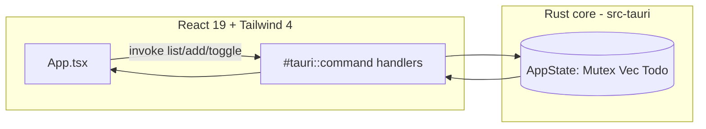

# capstone — React-TS 19 + Tailwind 4 + Vite + Tauri

The final project: a desktop **Todo app** with a modern web frontend and a Rust
core, tying the whole roadmap together.

## Stack

| Layer | Tech |
| --- | --- |
| Frontend | React 19 + TypeScript, Vite 6 |
| Styling | Tailwind CSS v4 (via `@tailwindcss/vite`, no config file) |
| Desktop shell | Tauri v2 (system WebView, tiny binary) |
| Backend | Rust — commands + `Arc<Mutex<...>>` shared state |

## Run it

Requires the Tauri prerequisites (Rust — you have it — plus Node.js and the OS
WebView/build tools; see `tauri_01_notes`). Then:

```bash
cd capstone
npm install
npm run tauri dev     # dev with hot reload
# or produce an installer:
npm run tauri build
```

> This app is **not** part of the root Cargo workspace on purpose: Tauri apps
> build standalone with the Node + WebView toolchain, so keeping it separate
> avoids forcing that toolchain on the rest of the learning workspace. That's why
> there's no committed `node_modules`/`dist`/`target` — they're generated by the
> commands above.

> App **icons** (`src-tauri/icons/`) are also generated, not committed. Create
> them once with `npm run tauri icon path/to/logo.png` (or they're scaffolded by
> `npm create tauri-app`). Without them, `tauri build` will ask for
> `icons/icon.ico`.

## How the pieces talk



## Files that matter

```text
capstone/
├── package.json           # React 19, Tailwind 4, Vite, Tauri CLI
├── vite.config.ts         # react() + tailwindcss() plugins, port 1420
├── index.html
├── src/
│   ├── main.tsx           # React entry
│   ├── index.css          # @import "tailwindcss";
│   └── App.tsx            # UI + invoke() calls to Rust
└── src-tauri/
    ├── Cargo.toml
    ├── build.rs
    ├── tauri.conf.json    # dev/build commands, window, bundle
    ├── capabilities/default.json
    └── src/
        ├── lib.rs         # commands + shared state
        └── main.rs
```

## What it demonstrates from the roadmap

- **Structs + serde** (`learn_03`, `proj_01`): `Todo` crosses the IPC bridge as JSON.
- **Shared state / ownership** (`learn_02`, `learn_11`): `Arc<Mutex<Vec<Todo>>>`
  via `tauri::State`.
- **Traits/derive** (`learn_05`): `#[derive(Serialize, Deserialize, Clone)]`.
- **Tauri IPC** (`tauri_01_notes`): `#[tauri::command]` + `invoke`.
- Frontend skills you already have (React/TS) driving a Rust backend.

## Extend it

- Persist todos to disk (serde_json file, like `proj_01_cli_todo`).
- Swap in the `tauri-plugin-sql` or reuse the sqlx pattern from `proj_03`.
- Add filtering/among tabs; add a native menu; package installers per-OS.
