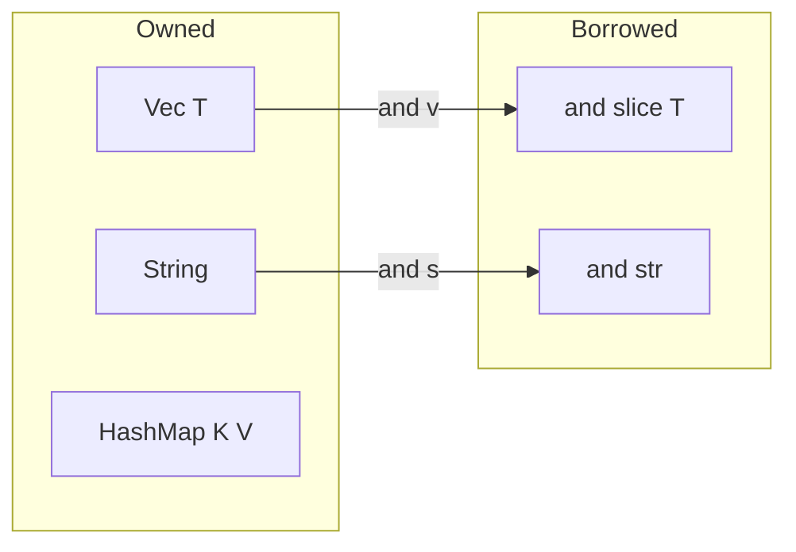

# concept_08_collections — Vec, HashMap, HashSet, Strings

Storing many values in Rust's standard collections.

## Concepts in order

| # | Binary | Concept | Analogy |
| --- | --- | --- | --- |
| 01 | `concept_08_01_vectors` | `Vec<T>` growable list | `ArrayList` / JS array |
| 02 | `concept_08_02_hashmap` | `HashMap<K,V>` + `entry()` | `HashMap` / JS `Map` |
| 03 | `concept_08_03_string_vs_str` | owned vs borrowed strings | `StringBuilder` vs substring |
| 04 | `concept_08_04_hashset` | `HashSet<T>` unique values | `HashSet` / JS `Set` |

> Generics moved to [`concept_07_generics`](../concept_07_generics/).

## Owned vs borrowed cheat-sheet

## Key points

- `Vec` indexing (`v[i]`) panics out of range; `v.get(i)` returns `Option`.
- `HashMap::entry(k).or_insert(v)` is the idiomatic upsert/count pattern.
- Prefer `&str` parameters; return `String` when you own new data.
- `HashSet` stores unique values; great for membership tests and dedup.
