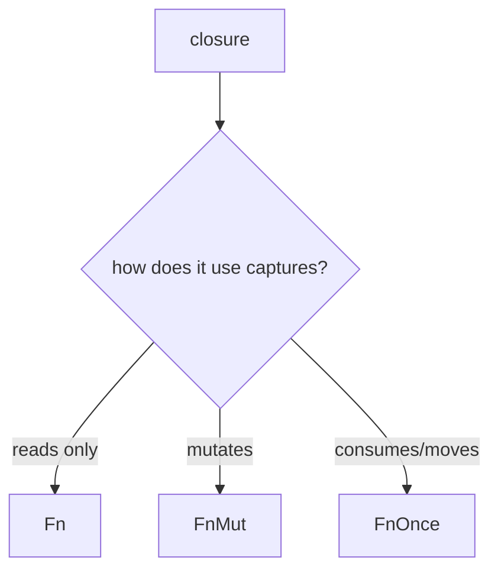

# concept_09_closures_iterators — Closures & Iterators

The functional side of Rust. Very familiar coming from JS/TS array methods and
arrow functions — but with ownership rules and zero-cost laziness.

## Concepts

| # | Binary | Concept | Analogy |
| --- | --- | --- | --- |
| 01 | `concept_09_01_closures` | closures, capture, `move`, `impl Fn` | arrow functions |
| 02 | `concept_09_02_iterators` | `map`/`filter`/`fold`/`collect` | JS array methods |
| 03 | `concept_09_03_Fn_FnMut_FnOnce` | the three closure traits | — |
| 04 | `concept_09_04_closure_as_output` | returning closures (`impl Fn`) | — |
| 05 | `concept_09_05_iterators_advanced` | iterators, a deeper look | — |
| 06 | `concept_09_06_iter_into_iter_iter_mut` | `iter` / `into_iter` / `iter_mut` | — |
| 07 | `concept_09_07_iterator_adaptors` | adaptor chains | — |
| 08 | `concept_09_08_function_pointer` | function pointers vs closures | — |

## Closure capture & Fn traits

## Key points

- `|x| x + 1` captures its environment automatically. `move` forces capture by
  value (needed to return a closure or send it to a thread).
- Iterator **adapters** (`map`, `filter`) are **lazy** — nothing runs until a
  **consumer** (`collect`, `sum`, `for`) drives the chain.
- Chains compile down to tight loops (zero-cost abstraction) — no intermediate
  arrays unless you `collect`.
