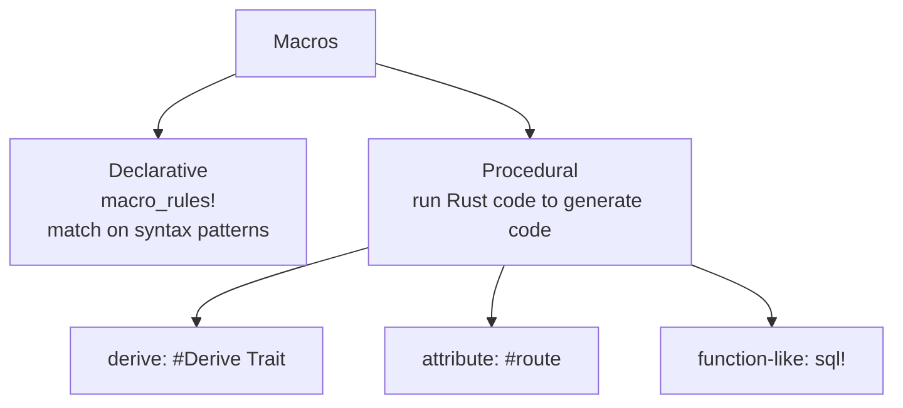

# concept_14_macros — Macros

Macros generate code at compile time, before type checking. They enable things
functions can't: variadic arguments, custom syntax, and auto-implemented traits.
You spot a macro by the `!` at the call site (`println!`, `vec!`, `assert_eq!`).

This folder follows the order of the
[Rust by Example — Macros](https://doc.rust-lang.org/stable/rust-by-example/macros.html)
chapter, then finishes with procedural macros.

## Concepts

| # | Binary | Concept | RBE section |
| --- | --- | --- | --- |
| 01 | `concept_14_01_macro_rules` | basics of `macro_rules!` (match on syntax) | Syntax |
| 02 | `concept_14_02_designators` | capture syntax with `$name:designator` | Designators |
| 03 | `concept_14_03_overload` | multiple rules / custom syntax | Overload |
| 04 | `concept_14_04_variadic` | variadic macros with `$( ... )*` | Repeat |
| 05 | `concept_14_05_dsl` | a tiny DSL (`calculate! { eval ... }`) | DSL |
| 06 | `concept_14_06_dry` | generate whole `fn`s + tests; `tt` designator | DRY |
| 07 | `concept_14_07_derive_and_builtin` | derive (procedural) macros + built-ins | — |
| 08 | `concept_14_08_proc_macro_use` | USE custom proc-macros: derive + attribute + function-like | — |

```bash
cargo run --bin concept_14_01_macro_rules
cargo run --bin concept_14_02_designators
cargo run --bin concept_14_03_overload
cargo run --bin concept_14_04_variadic
cargo run --bin concept_14_05_dsl
cargo run  --bin concept_14_06_dry   # and: cargo test --bin concept_14_06_dry
cargo run --bin concept_14_07_derive_and_builtin
cargo run --bin concept_14_08_proc_macro_use
```

> The custom derive macro itself lives in a **separate crate**,
> [`concept_14_proc_macro`](../concept_14_proc_macro/src/lib.rs), because proc-macro
> crates compile into a compiler plugin and cannot live in `src/bin/`. Lesson 08
> is the *consumer*; that crate is the *implementation*.

## Two macro families



## Key points

- **Declarative (`macro_rules!`)**: works like a `match`, but matches on token
  patterns instead of values. Each rule is `(pattern) => { expansion };`.
- **Designators** name what you capture: `expr`, `ident`, `ty`, `stmt`, `block`,
  `pat`, `literal`, `path`, `tt`. Use `stringify!` to turn a token into text.
- **Overloading**: several rules, tried top-to-bottom; the pattern can contain
  literal tokens (e.g. `; and`) to build custom syntax.
- **Repetition** `$( ... ),*` / `+` / `?` gives variadic input — this is how
  `vec!` works. Macros can also recurse (see `find_min!`).
- **DRY / code-gen**: a macro can define whole `fn`s (even `#[test]` fns) from a
  few tokens, and can call other macros. The `tt` (token tree) designator
  captures operators like `+=` that aren't an `expr` or `ident` (see `op!`).
- **Procedural**: actual Rust code that transforms a token stream. This is what
  `#[derive(Debug)]`, `#[tokio::main]`, and framework attributes (`#[get("/")]`)
  are. Writing your own needs a `proc-macro = true` crate with `syn` + `quote`.
- Common built-ins: `println!`, `format!`, `vec!`, `assert_eq!`, `dbg!`,
  `eprintln!`.
- Rule of thumb: reach for a function first; use a macro only when you need
  compile-time code generation or custom syntax.
