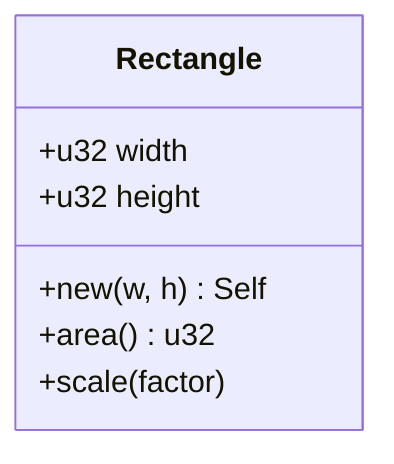

# learn_03_structs_enums — Structs, Enums, Option, Pattern Matching

Modeling data. Structs group related fields; enums express "one of several
shapes". Together with `match` they replace class hierarchies and `null`.

## Concepts in order

| # | Binary | Concept | Analogy |
| --- | --- | --- | --- |
| 01 | `learn_03_01_structs` | named/tuple structs, update syntax | class fields / records |
| 02 | `learn_03_02_methods` | `impl`, methods, associated fns | methods + static factories |
| 03 | `learn_03_03_enums` | enums with data + `match` | TS discriminated unions |
| 04 | `learn_03_04_option` | `Option<T>` instead of null | nullable, but enforced |
| 05 | `learn_03_05_pattern_matching` | ranges, guards, destructuring | powered-up `switch` |

## Struct + impl vs a class

Rust splits **data** (`struct`) from **behavior** (`impl`). There is no
inheritance; you compose and use traits (see `learn_05_traits`) for shared
behavior.

## Why enums + Option matter

- `enum` variants can carry different data, and `match` forces you to handle
  every variant — no forgotten case.
- `Option<T>` (`Some`/`None`) replaces `null`. You cannot accidentally use a
  missing value; the compiler makes you handle `None`.
