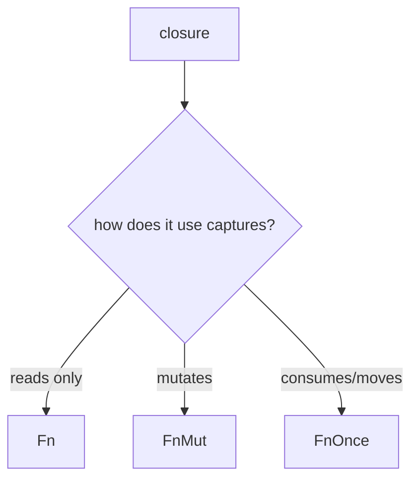

# learn_08_closures_iterators — Closures & Iterators

The functional side of Rust. Very familiar coming from JS/TS array methods and
arrow functions — but with ownership rules and zero-cost laziness.

## Concepts

| # | Binary | Concept | Analogy |
| --- | --- | --- | --- |
| 01 | `learn_08_01_closures` | closures, capture, `move`, `impl Fn` | arrow functions |
| 02 | `learn_08_02_iterators` | `map`/`filter`/`fold`/`collect` | JS array methods |

## Closure capture & Fn traits

## Key points

- `|x| x + 1` captures its environment automatically. `move` forces capture by
  value (needed to return a closure or send it to a thread).
- Iterator **adapters** (`map`, `filter`) are **lazy** — nothing runs until a
  **consumer** (`collect`, `sum`, `for`) drives the chain.
- Chains compile down to tight loops (zero-cost abstraction) — no intermediate
  arrays unless you `collect`.
