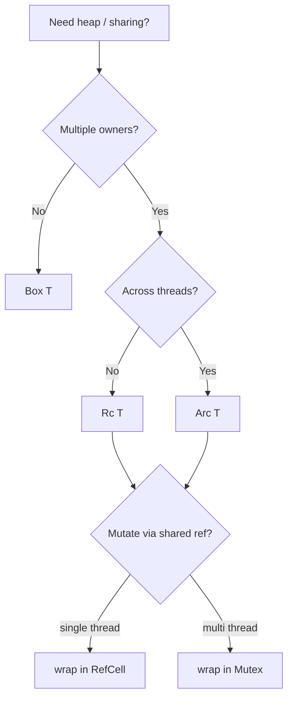

# learn_09_smart_pointers — Box, Rc, RefCell, Arc

Types that own heap data and add capabilities (shared ownership, interior
mutability, thread-safety) while keeping Rust's safety guarantees.

## Concepts

| # | Binary | Type | Use for |
| --- | --- | --- | --- |
| 01 | `learn_09_01_box` | `Box<T>` | single owner, heap, recursive types |
| 02 | `learn_09_02_rc_refcell` | `Rc<T>`, `RefCell<T>` | shared ownership + runtime-checked mutation |
| 03 | `learn_09_03_arc` | `Arc<T>`, `Mutex<T>` | shared state across threads |

## Choosing a smart pointer

## Key points

- `Box<T>`: one owner, heap-allocated. Enables recursive enums/structs.
- `Rc<T>`: reference-counted shared ownership, single-threaded.
- `RefCell<T>`: move borrow checking to **runtime**, allowing mutation through a
  shared reference (panics if you break the rules at runtime).
- `Arc<T>`: atomic `Rc` for threads; combine with `Mutex<T>` for shared mutable
  state. (More concurrency in `learn_110`.)
