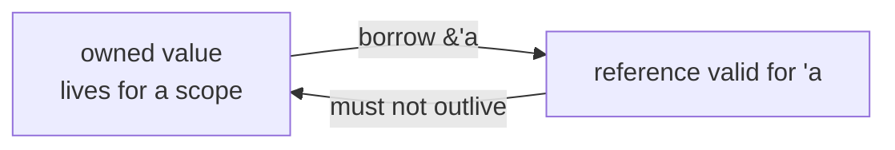

# learn_100_lifetimes — Lifetimes

Lifetimes are how the borrow checker proves references never outlive the data
they point to. They are compile-time only — zero runtime cost.

## Concepts

| # | Binary | Concept |
| --- | --- | --- |
| 01 | `learn_100_01_lifetimes` | `'a` on functions, elision |
| 02 | `learn_100_02_struct_lifetimes` | structs that hold references |

## Mental model

## Key points

- `'a` is a generic **lifetime parameter** — like `<T>` but for "how long is
  this reference valid".
- `fn longest<'a>(x: &'a str, y: &'a str) -> &'a str` says the result lives as
  long as the shorter input.
- **Elision**: the compiler infers lifetimes in common cases, so most functions
  need none.
- A struct storing a reference (`struct S<'a> { r: &'a str }`) cannot outlive the
  borrowed data. This is the compile-time guarantee that replaces GC + prevents
  use-after-free.
