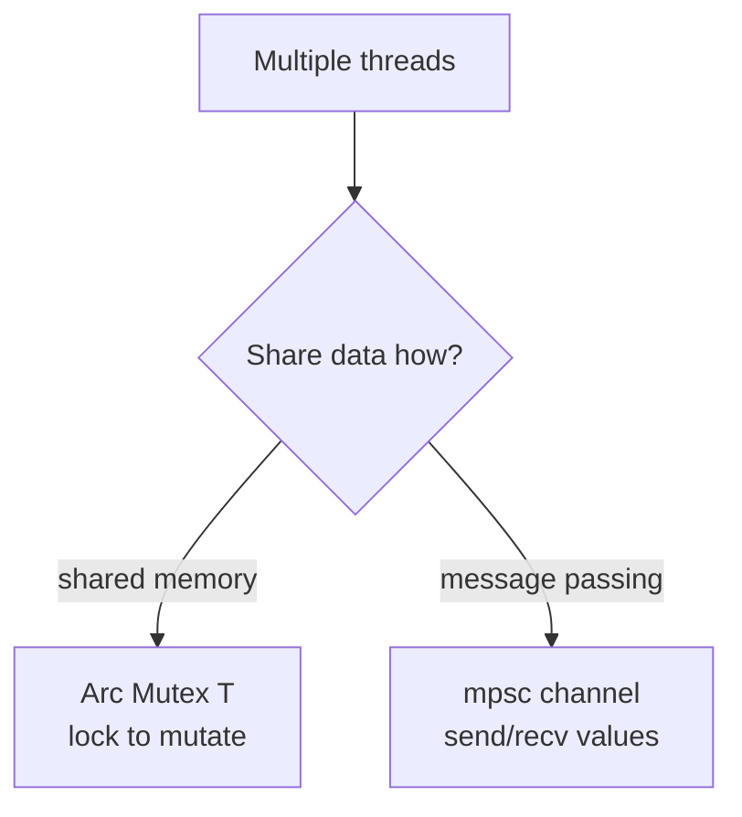

# learn_11_concurrency — Threads, Shared State, Channels

Rust's "fearless concurrency": the ownership/borrow rules that felt strict in
single-threaded code are exactly what prevent data races across threads — at
compile time.

## Concepts

| # | Binary | Concept | Analogy |
| --- | --- | --- | --- |
| 01 | `learn_11_01_threads` | `thread::spawn`, `join` | `Thread` / worker |
| 02 | `learn_11_02_shared_state` | `Arc<Mutex<T>>` | synchronized shared variable |
| 03 | `learn_11_03_channels` | `mpsc` message passing | Go channels / event queue |

## Two ways to coordinate

## Key points

- `thread::spawn(move || ...)` runs a closure on a new OS thread; `move` gives it
  ownership of captured values. `join()` waits and collects the result.
- Shared mutable state needs `Arc<Mutex<T>>`: `Arc` for multi-thread ownership,
  `Mutex` for exclusive access. The compiler rejects unsynchronized sharing.
- Channels (`mpsc`) pass ownership of messages between threads — often cleaner
  than locks. Dropping all senders ends the receiver loop.
- `Send`/`Sync` marker traits are what make this safe; most types are auto-`Send`.
- Async concurrency (Tokio) is the next module (`learn_12`).
