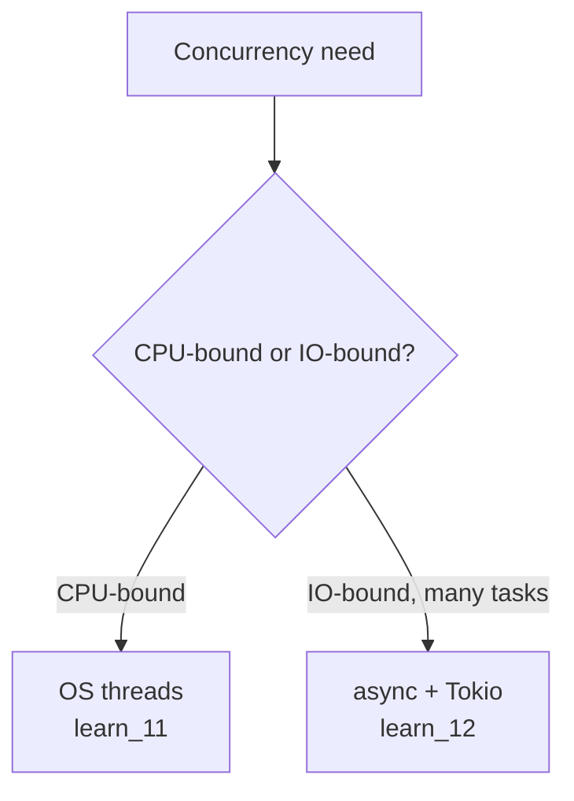

# learn_12_async_tokio — Async/Await with Tokio

Asynchronous, non-blocking concurrency. If you know `async`/`await` and the Node
event loop, this will feel familiar — Tokio is the runtime that drives it.

## Concepts

| # | Binary | Concept | JS analogy |
| --- | --- | --- | --- |
| 01 | `learn_12_01_async_await` | `async fn`, `.await`, `#[tokio::main]` | `async`/`await`, event loop |
| 02 | `learn_12_02_tasks` | `join!`, `tokio::spawn` | `Promise.all`, background tasks |
| 03 | `learn_12_03_async_channels` | `tokio::sync::mpsc` | async event queue |

## Threads vs async

## Key points

- An `async fn` returns a **Future** (like a `Promise`) — lazy; nothing runs
  until `.await` (or the runtime) drives it.
- `#[tokio::main]` wraps `main` in the runtime (like Node providing the loop).
- `tokio::join!` awaits several futures **concurrently** (≈ `Promise.all`),
  while sequential `.await`s run one after another.
- `tokio::spawn` schedules a task on the runtime's thread pool; await its handle
  for the result.
- Use async for **IO-bound** work with many tasks (servers, clients); use OS
  threads (`learn_11`) for **CPU-bound** parallelism. The web projects
  (`proj_03`, `proj_04`) build on this.
