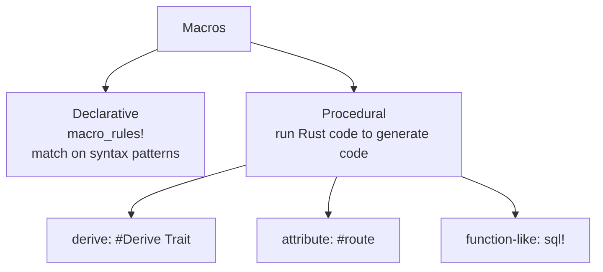

# learn_13_macros — Macros

Macros generate code at compile time, before type checking. They enable things
functions can't: variadic arguments, custom syntax, and auto-implemented traits.

## Concepts

| # | Binary | Concept |
| --- | --- | --- |
| 01 | `learn_13_01_macro_rules` | declarative `macro_rules!` (pattern-based) |
| 02 | `learn_13_02_derive_and_builtin` | derive (procedural) macros + built-ins |

## Two macro families

## Key points

- **Declarative (`macro_rules!`)**: match on token patterns and expand. Supports
  repetition `$( ... )*` for variadic input (e.g. how `vec!` works).
- **Procedural**: actual Rust code that transforms a token stream. This is what
  `#[derive(Debug)]`, `#[tokio::main]`, and framework attributes (`#[get("/")]`)
  are. Writing your own needs a `proc-macro = true` crate with `syn` + `quote`.
- Common built-ins: `println!`, `format!`, `vec!`, `assert_eq!`, `dbg!`,
  `eprintln!`.
- Rule of thumb: reach for a function first; use a macro only when you need
  compile-time code generation or custom syntax.
