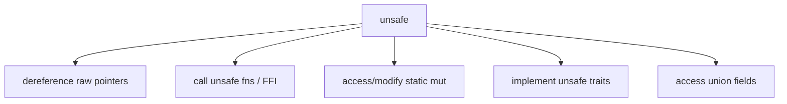

# learn_14_unsafe_ffi — Unsafe Rust & FFI

Rust's escape hatch for low-level work: interfacing with C, hardware, or
performance-critical code the borrow checker can't verify. Used sparingly and
wrapped in safe APIs.

## Concepts

| # | Binary | Concept |
| --- | --- | --- |
| 01 | `learn_14_01_unsafe` | `unsafe` blocks, raw pointers, unsafe fns |
| 02 | `learn_14_02_ffi` | `extern "C"` — calling C from Rust |

## What `unsafe` actually unlocks

`unsafe` does **not** disable the borrow checker. It only enables these five
extra abilities, and asks you to uphold the invariants manually.

## Key points

- Prefer safe Rust. Reach for `unsafe` only for FFI, hardware, or proven perf
  needs — and **wrap it in a safe function** so callers stay safe.
- Raw pointers `*const T` / `*mut T` can be created safely but only dereferenced
  in `unsafe`.
- `extern "C"` uses the C ABI. This is the foundation of every `-sys` crate that
  wraps a C library, and conceptually how desktop frameworks like **Tauri**
  reach native platform APIs.
- Keep `unsafe` blocks small and document the invariant you're upholding.
