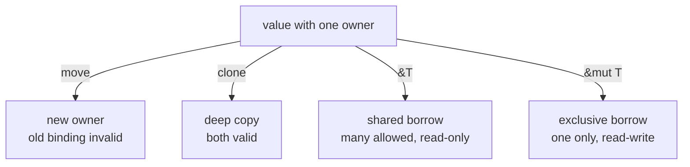

# learn_20_ownership — Ownership, Borrowing, Slices

The one big idea with **no equivalent** in Java/JS/TS. Rust has no garbage
collector; instead the compiler tracks who *owns* each value and frees it
automatically when the owner goes out of scope.

## Concepts in order

| # | Binary | Concept |
| --- | --- | --- |
| 01 | `learn_20_01_ownership_move` | ownership rules, move vs copy, `clone` |
| 02 | `learn_20_02_borrowing` | `&` shared vs `&mut` exclusive references |
| 03 | `learn_20_03_slices` | `&str` / `&[T]` borrowed views |
| 04 | `learn_20_04_stack_heap` | where values live, why ownership exists |

## The three rules

1. Each value has exactly one **owner**.
2. When the owner goes out of scope, the value is **dropped** (freed).
3. You can **borrow** a value with references instead of taking ownership.

## Borrowing rules

At any given time you may have **either**:

- any number of immutable references `&T`, **or**
- exactly one mutable reference `&mut T`

...but never both at once. This prevents data races at compile time.

## Coming from GC languages

- In JS/Java, assigning an object copies a *reference*; the GC frees it later.
- In Rust, assigning a heap value **moves** ownership; the old binding becomes
  invalid, and the value is freed deterministically when its owner scope ends.
- Use `&`/`&mut` to lend access without giving up ownership.
