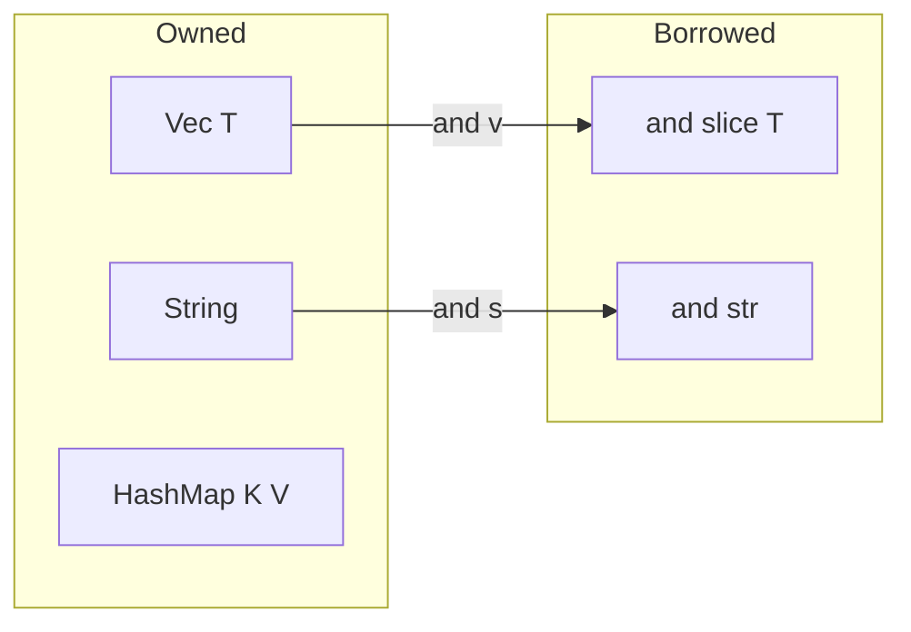

# learn_40_collections_generics — Vec, HashMap, Strings, Generics

Storing many values and writing code that works over many types.

## Concepts in order

| # | Binary | Concept | Analogy |
| --- | --- | --- | --- |
| 01 | `learn_40_01_vectors` | `Vec<T>` growable list | `ArrayList` / JS array |
| 02 | `learn_40_02_hashmap` | `HashMap<K,V>` + `entry()` | `HashMap` / JS `Map` |
| 03 | `learn_40_03_string_vs_str` | owned vs borrowed strings | `StringBuilder` vs substring |
| 04 | `learn_40_04_generics` | generic fns/structs + bounds | `<T>` in Java/TS |

## Owned vs borrowed cheat-sheet

## Key points

- `Vec` indexing (`v[i]`) panics out of range; `v.get(i)` returns `Option`.
- `HashMap::entry(k).or_insert(v)` is the idiomatic upsert/count pattern.
- Prefer `&str` parameters; return `String` when you own new data.
- Generic bounds (`T: PartialOrd`) declare what capabilities `T` must have —
  they're checked at compile time, then monomorphized (zero runtime cost).
