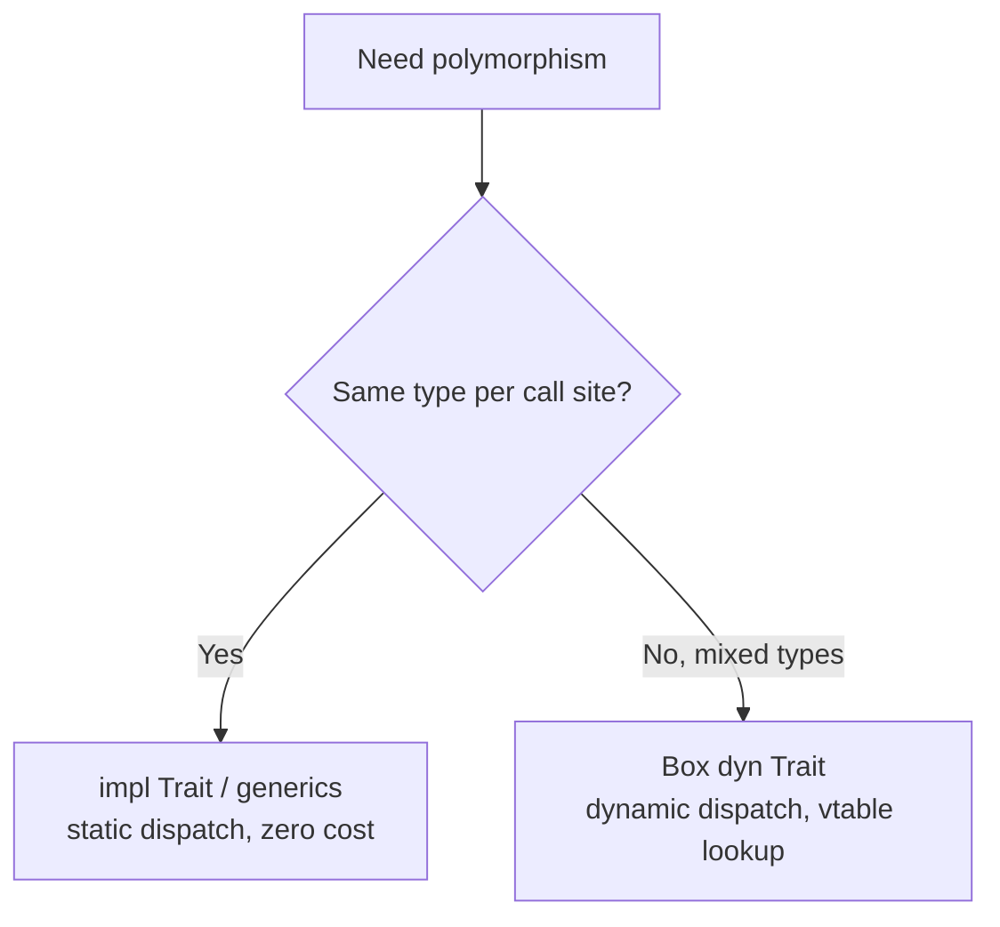

# learn_50_traits — Traits (Rust's interfaces)

Traits define shared behavior that types opt into. This is how Rust does
polymorphism without inheritance.

## Concepts in order

| # | Binary | Concept | Analogy |
| --- | --- | --- | --- |
| 01 | `learn_50_01_traits` | trait def, `impl`, default methods | `interface` + default methods |
| 02 | `learn_50_02_trait_objects` | static (`impl Trait`) vs dynamic (`dyn`) | generics vs interface reference |
| 03 | `learn_50_03_derive_display` | `#[derive(...)]`, manual `Display` | auto `equals/hashCode`, `toString` |

## Static vs dynamic dispatch

## Key points

- `trait ~ interface`. Types declare `impl Trait for Type`.
- Default method bodies let types share logic and override selectively.
- `impl Trait` / `<T: Trait>` = **static dispatch**, resolved at compile time.
- `Box<dyn Trait>` = **dynamic dispatch**, for heterogeneous collections.
- `#[derive(Debug, Clone, PartialEq, ...)]` auto-generates common trait impls.
