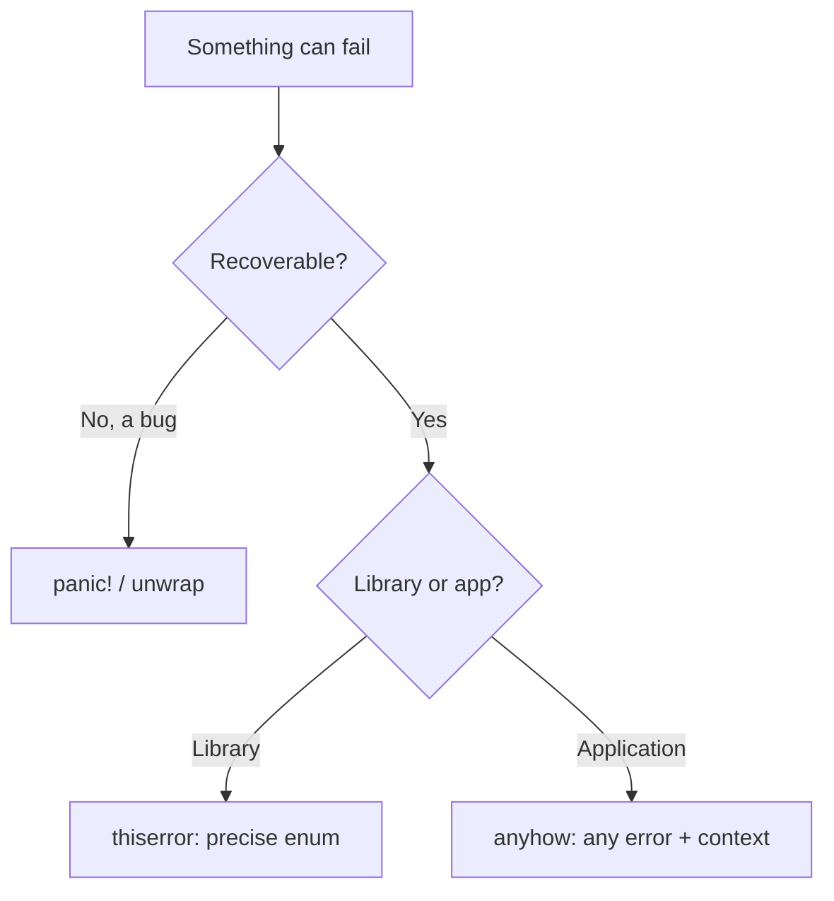

# learn_60_error_handling — Result, ?, panic, thiserror, anyhow

Rust has no exceptions. Recoverable errors are values (`Result`); truly
unrecoverable bugs use `panic!`.

## Concepts in order

| # | Binary | Concept | Analogy |
| --- | --- | --- | --- |
| 01 | `learn_60_01_result` | `Result<T,E>`, `?` operator | `try/catch` in the type system |
| 02 | `learn_60_02_panic` | `panic!` vs recoverable errors | unchecked exception vs handled |
| 03 | `learn_60_03_thiserror` | custom error enums (libraries) | custom `Exception` classes |
| 04 | `learn_60_04_anyhow` | catch-all errors (apps) | generic `catch (e)` |

## Choosing an approach

## Key points

- `?` propagates `Err` early and unwraps `Ok` — the backbone of error flow.
- `panic!` is for invariants that should never break, not expected failures.
- **thiserror**: derive `Error` for a typed error enum; `#[from]` lets `?`
  auto-convert. Best for libraries where callers match on error kinds.
- **anyhow**: one `Result` type for everything, `.context()` adds messages.
  Best for application/`main` code where you just want it to bubble up.
