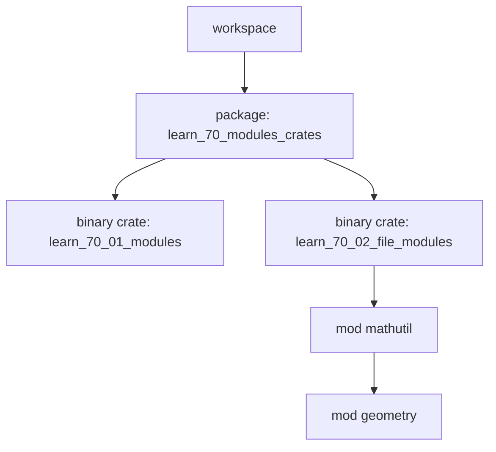

# learn_70_modules_crates — Modules, Paths, Visibility

How Rust organizes code within a crate, and how crates relate.

## Concepts

| # | Binary | Concept | Analogy |
| --- | --- | --- | --- |
| 01 | `learn_70_01_modules` | `mod`, `pub`, `use`, `super::` | TS namespaces / Java packages |
| 02 | `learn_70_02_file_modules` | modules split across files | one class per file |

## Vocabulary

- **module (`mod`)**: a namespace. Items are **private by default**; `pub` exposes.
- **crate**: a compilation unit. A *binary* crate has `main`; a *library* crate
  exposes an API. Each folder here is a crate (package) in the workspace.
- **package**: a `Cargo.toml` + one or more crates.
- **workspace**: multiple packages sharing `target/` and `Cargo.lock` (this repo).

## Path rules

- `crate::` = crate root, `super::` = parent module, `self::` = current module.
- `use path::to::item;` brings a name into scope (like an import).
- File-based: `mod foo;` in `bin/x.rs` loads `bin/x/foo.rs`.
