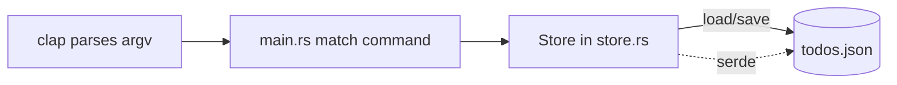

# proj_01_cli_todo — CLI Todo App

First real project: a command-line todo list that persists to a JSON file.
Ties together **clap** (arg parsing), **serde/serde_json** (persistence), and
**anyhow** (error handling) from the learn_* modules.

## Run

```bash
cargo run --bin proj_01_cli_todo -- add "buy milk"
cargo run --bin proj_01_cli_todo -- add "write rust"
cargo run --bin proj_01_cli_todo -- list
cargo run --bin proj_01_cli_todo -- done 1
cargo run --bin proj_01_cli_todo -- remove 2
```

`--` separates cargo's args from the program's args. Tasks are stored in
`todos.json` in the current directory (git-ignored).

## Commands

| Command | Effect |
| --- | --- |
| `add <text>` | add a task |
| `list` | show all tasks with `[ ]` / `[x]` state |
| `done <id>` | mark a task complete |
| `remove <id>` | delete a task |

## Architecture



## Concepts applied

- **clap derive**: `#[derive(Parser)]` + `#[derive(Subcommand)]` build the CLI
  from types — like decorator-based command definitions in TS.
- **serde**: `#[derive(Serialize, Deserialize)]` maps `Task`/`Store` to JSON.
- **anyhow + `?`**: file/parse errors bubble up with `.context()` messages.
- **ownership**: `&mut self` methods mutate the store; `retain` filters in place.
