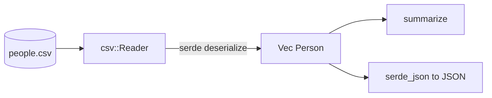

# proj_02_file_parser — CSV/JSON File Parser

Reads a CSV file into typed records with **serde** + the **csv** crate, then
either prints a summary or re-emits the data as JSON. Focus: parsing across
formats and real error handling with **anyhow** context.

## Run

```bash
# Summary (default):
cargo run --bin proj_02_file_parser -- data/people.csv

# JSON output:
cargo run --bin proj_02_file_parser -- data/people.csv --json
```

Run from the `proj_02_file_parser` folder so the relative `data/people.csv`
path resolves, or pass an absolute path.

## Flow



## Concepts applied

- **serde across formats**: the same `Person` struct deserializes from CSV and
  serializes to JSON — one type, two formats.
- **error context**: `.with_context(|| ...)` labels which file/row failed, so a
  bad line produces a useful message instead of a bare error.
- **iterators**: `sum`, `max_by_key`, `map` compute the summary.
- **Option**: `oldest` is `Option<String>` (empty input => `None`).
