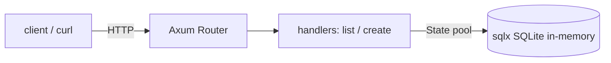

# proj_03_web_api_axum — REST API (Axum + Tokio + sqlx)

A tasks REST API built on **Axum** (routing/handlers), **Tokio** (async runtime),
and **sqlx** (async SQL). Uses **in-memory SQLite**, so it runs with no database
server and no `DATABASE_URL`.

## Run

```bash
cargo run --bin proj_03_web_api_axum
# in another terminal:
curl localhost:3000/health
curl localhost:3000/tasks
curl -X POST localhost:3000/tasks \
  -H "content-type: application/json" \
  -d '{"text":"buy milk"}'
```

Self-contained check (no HTTP client needed):

```bash
cargo run --bin proj_03_web_api_axum -- --selftest
```

## Endpoints

| Method | Path | Body | Response |
| --- | --- | --- | --- |
| GET | `/health` | — | `ok` |
| GET | `/tasks` | — | `[{id,text,done}]` |
| POST | `/tasks` | `{"text": "..."}` | `201` + created task |

## Architecture



## Concepts applied

- **Axum**: `Router` maps paths to handlers; `State` injects the DB pool;
  extractors like `Json<T>` deserialize the body; handlers return `impl
  IntoResponse`.
- **Tokio**: `#[tokio::main]` + `axum::serve` run the async server.
- **sqlx**: an async `SqlitePool`; `query(...).bind(...).fetch_all/execute`.
  In-memory keeps it runnable anywhere. For compile-time-checked queries
  (`query!`), you'd point `DATABASE_URL` at a real DB at build time.
- Maps to what you know: Axum ≈ Express/Spring, sqlx ≈ JDBC/Prisma.
