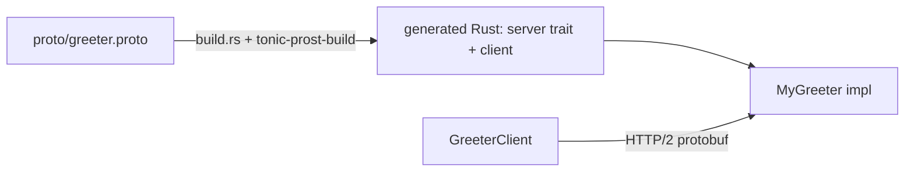

# proj_04_grpc — gRPC Service (tonic)

A gRPC service built with **tonic**, to contrast with the REST/HTTP approach in
`proj_03_web_api_axum`. gRPC uses a typed `.proto` contract, HTTP/2 transport,
and binary protobuf payloads, with client/server stubs generated at build time.

## Run

```bash
# Start the server:
cargo run --bin proj_04_grpc

# Self-contained round-trip (spawns server + calls it with the generated client):
cargo run --bin proj_04_grpc -- --selftest
```

## How it's wired



- `proto/greeter.proto` defines the `Greeter` service and messages.
- `build.rs` compiles it via `tonic-prost-build`. Since no system `protoc` is
  installed, we use the prebuilt binary from `protoc-bin-vendored` and point the
  `PROTOC` env var at it — so it builds anywhere with no manual setup.
- `tonic::include_proto!("greeter")` pulls the generated code into `main.rs`.

## REST (Axum) vs gRPC (tonic)

| | REST (`proj_03`) | gRPC (`proj_04`) |
| --- | --- | --- |
| Contract | ad-hoc JSON | typed `.proto` (enforced) |
| Transport | HTTP/1.1 | HTTP/2 |
| Payload | JSON (text) | protobuf (binary) |
| Codegen | none | server/client stubs |
| Best for | browsers, public APIs | service-to-service, streaming |

## Notes

- tonic 0.14 split proto compilation into `tonic-prost-build` (build) and the
  `tonic-prost` codec (runtime); older examples used `tonic-build::compile_protos`.
- gRPC isn't directly callable from `curl`; use a generated client (as in
  `--selftest`) or a tool like `grpcurl`.
