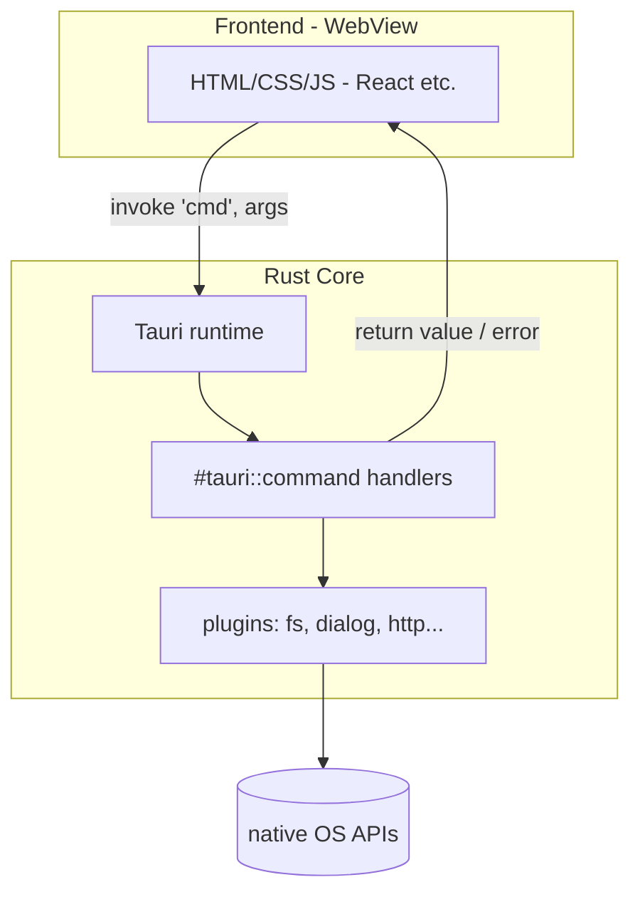
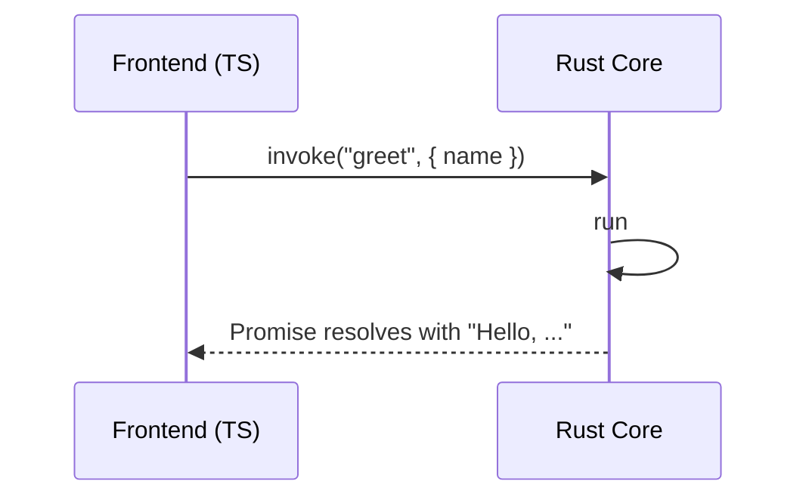
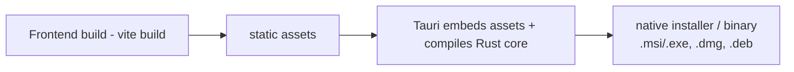

# tauri_01_notes — How Tauri Works

Notes on Tauri (no code to build here — this folder is documentation). Tauri
lets you build desktop (and mobile) apps with a **Rust backend** and a **web
frontend** (React/Vue/Svelte/plain HTML), rendered in the OS's native WebView.

## Tauri vs Electron (coming from Node)

| | Electron | Tauri |
| --- | --- | --- |
| Backend | Node.js | Rust |
| Renderer | bundles Chromium | OS **system WebView** |
| App size | ~100–200 MB | a few MB |
| Memory | high | low |
| Frontend | any web stack | any web stack |

Key idea: Tauri does **not** ship a browser. It uses the WebView already on the
OS (WebView2 on Windows, WKWebView on macOS, WebKitGTK on Linux). That's why
apps are tiny.

## Architecture



- **Frontend** runs in the WebView, exactly like a normal web app.
- **Rust core** owns the window, native APIs, and your business logic.
- They talk over a typed **IPC bridge**.

## IPC: commands and `invoke`

The frontend calls Rust functions marked `#[tauri::command]` using `invoke`.

Rust side:

```rust
#[tauri::command]
fn greet(name: &str) -> String {
    format!("Hello, {name}!")
}

fn main() {
    tauri::Builder::default()
        .invoke_handler(tauri::generate_handler![greet])
        .run(tauri::generate_context!())
        .expect("error while running tauri app");
}
```

Frontend side (TypeScript):

```ts
import { invoke } from "@tauri-apps/api/core";

const msg = await invoke<string>("greet", { name: "Ravinder" });
console.log(msg); // "Hello, Ravinder!"
```



Commands are `async`-friendly and can return `Result<T, E>`; an `Err` rejects
the JS promise. Arguments/return values are serialized with serde (JSON).

## Security model

- The WebView can **only** call the commands you explicitly register — there's
  no ambient access to the filesystem or OS from JS.
- **Capabilities/permissions** (Tauri v2) gate what plugins the frontend may use,
  per-window. You opt in to `fs`, `dialog`, `http`, etc.
- Keep secrets and privileged logic in Rust; treat the frontend as untrusted.

## Build pipeline



- `cargo tauri dev` runs the frontend dev server + Rust core with hot reload.
- `cargo tauri build` bundles the frontend, compiles the Rust core, and produces
  a platform installer.

## Project layout (typical Tauri v2 app)

```text
my-app/
├── src/                 # frontend (React/TS)
├── src-tauri/           # Rust core
│   ├── src/main.rs      # commands + Builder
│   ├── Cargo.toml
│   ├── tauri.conf.json  # app config (window, bundle, security)
│   └── capabilities/    # permission sets
├── package.json
└── vite.config.ts
```

## Prerequisites to actually build a Tauri app

- **Rust** (have it) + **Node.js/npm** for the frontend.
- OS WebView + build tools:
  - Windows: WebView2 (preinstalled on Win10+/11) + MSVC build tools.
  - macOS: Xcode command line tools.
  - Linux: `webkit2gtk`, `libayatana-appindicator`, etc.
- Scaffold with: `npm create tauri-app@latest`.

See `tauri_02_projects` for small app ideas and a minimal scaffold, and the
`capstone` folder for the React-TS 19 + Tailwind 4 + Vite + Tauri target.
