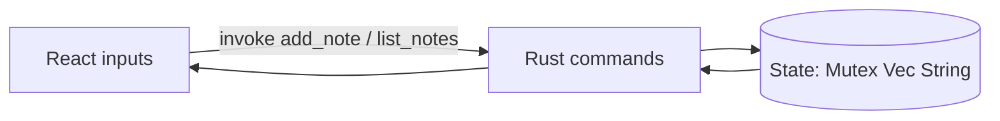

# tauri_02_projects — Small Tauri App Ideas + Minimal Scaffold

Building on `tauri_01_notes`. This folder is docs + a minimal scaffold you can
turn into a runnable app. Full Tauri apps need the Node + WebView toolchain
(see prerequisites in `tauri_01_notes`), so the scaffold is provided as ready-to-
copy files rather than a pre-built binary.

## Suggested progression

| # | App | New concept |
| --- | --- | --- |
| 1 | **Greeter** | one `#[tauri::command]`, `invoke` from the frontend |
| 2 | **Note taker** | state in Rust (`tauri::State`), list + add commands |
| 3 | **File reader** | `fs` plugin + capabilities (permissions) |
| 4 | **System info** | call native APIs, return structured data (serde) |

Each reuses what you learned: structs/enums, `Result` error handling, serde,
and (for note taker) `Arc<Mutex<T>>` shared state.

## Minimal scaffold (Greeter)

Create a real project with:

```bash
npm create tauri-app@latest greeter -- --template react-ts
cd greeter
npm install
npm run tauri dev
```

Then the two files that matter look like the snippets below.

### Rust core — `src-tauri/src/main.rs`

```rust
// A command is a Rust fn exposed to the frontend.
#[tauri::command]
fn greet(name: &str) -> String {
    format!("Hello, {name}! (from Rust)")
}

fn main() {
    tauri::Builder::default()
        .invoke_handler(tauri::generate_handler![greet])
        .run(tauri::generate_context!())
        .expect("error while running tauri app");
}
```

### Frontend — `src/App.tsx`

```tsx
import { useState } from "react";
import { invoke } from "@tauri-apps/api/core";

export default function App() {
  const [name, setName] = useState("");
  const [msg, setMsg] = useState("");

  async function onGreet() {
    // calls the Rust `greet` command
    setMsg(await invoke<string>("greet", { name }));
  }

  return (
    <main>
      <input value={name} onChange={(e) => setName(e.target.value)} />
      <button onClick={onGreet}>Greet</button>
      <p>{msg}</p>
    </main>
  );
}
```

## Note taker — adding Rust state

```rust
use std::sync::Mutex;

#[derive(Default)]
struct Notes(Mutex<Vec<String>>);

#[tauri::command]
fn add_note(state: tauri::State<Notes>, text: String) {
    state.0.lock().unwrap().push(text);
}

#[tauri::command]
fn list_notes(state: tauri::State<Notes>) -> Vec<String> {
    state.0.lock().unwrap().clone()
}

fn main() {
    tauri::Builder::default()
        .manage(Notes::default()) // register shared state
        .invoke_handler(tauri::generate_handler![add_note, list_notes])
        .run(tauri::generate_context!())
        .expect("run failed");
}
```



## Why scaffold, not a checked-in binary

`npm create tauri-app` pulls a large Node toolchain and platform WebView build
deps. Rather than commit a heavy generated project (and require that toolchain to
build in this workspace), these snippets show the exact wiring so you can
generate and run the app locally in minutes. The `capstone` folder does the same
for the full React-TS 19 + Tailwind 4 + Vite + Tauri target.
